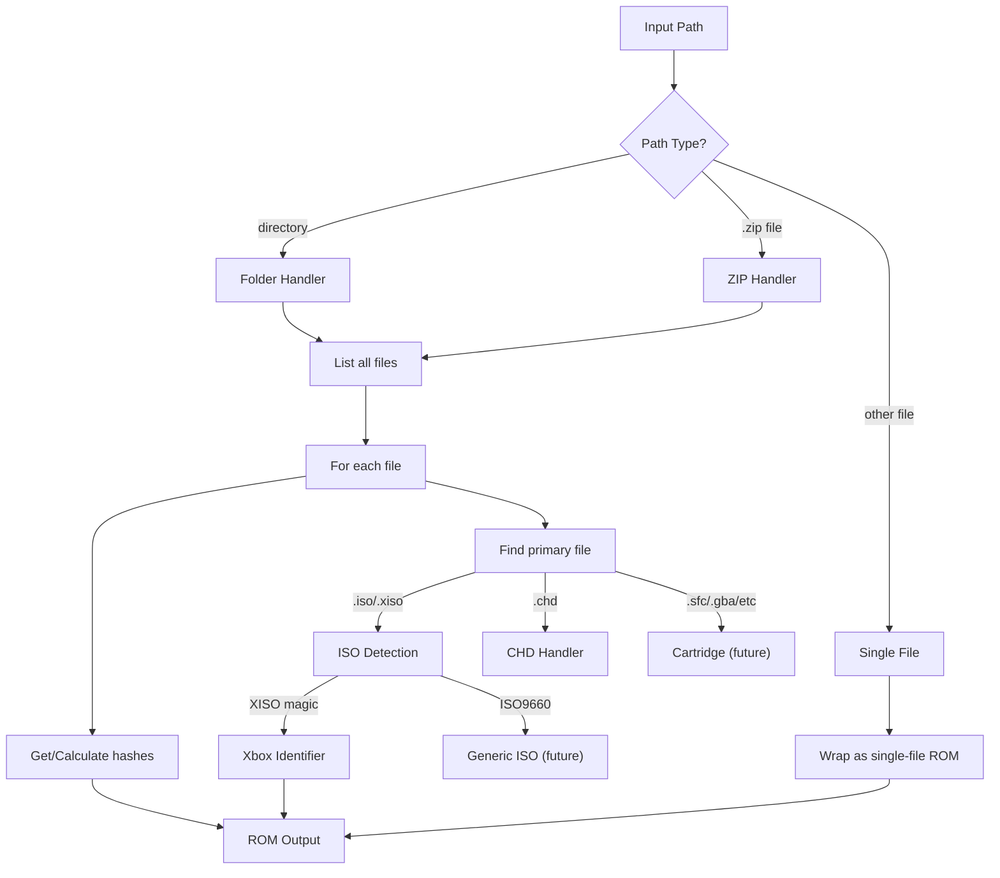

# ROM Identification Feature Plan (Revised)

## Core Concept: ROM as a Unit

A "ROM" is the unit of identification. It can be:

- A single loose file (`.iso`, `.sfc`, `.chd`)
- A ZIP archive containing related files (`.sfc` + `.sav`, `.cue` + `.bin` files)
- A folder containing related files

All files in a ROM are identified together. DAT files work the same way - one ROM entry may list multiple files that must all match.

## Data Model

```go
// ROM represents a complete game unit (single file, zip, or folder)
type ROM struct {
    Path       string      // Path to file/zip/folder
    Type       ROMType     // "file", "zip", "folder"
    Files      []ROMFile   // All files in this ROM
    Ident      *GameIdent  // Identification from primary file (if any)
}

type ROMFile struct {
    Name       string      // Filename (relative path within zip/folder)
    Size       int64
    Hashes     []Hash
    IsPrimary  bool        // True if this is the file used for identification
}

type Hash struct {
    Algorithm string      // "sha1", "md5", "crc32"
    Value     string      // hex-encoded
    Source    string      // "calculated", "zip-metadata", "chd-header"
}

type GameIdent struct {
    Platform   string
    TitleID    string
    Title      string
    Region     string
    Extra      map[string]string
}
```

## Architecture



## Primary File Selection

When a ROM contains multiple files, we identify based on the "primary" file:

| Pattern | Primary File | Notes |

| -------------------- | -------------- | ----------------------------------- |

| `.iso` / `.xiso` | The ISO | Disc games |

| `.chd` | The CHD | Compressed disc |

| `.cue` + `.bin` | The `.cue` | CD games (parse cue to verify bins) |

| `.gdi` + `.bin` | The `.gdi` | Dreamcast |

| `.sfc` + `.sav` | The `.sfc` | SNES with save |

| `.gba` + `.sav` | The `.gba` | GBA with save |

| Multiple `.bin` only | Largest `.bin` | Raw disc tracks |

## Hash Strategy

| Container | Hash Source |

| ---------- | ------------------------------------------------------------- |

| ZIP | CRC32 from zip metadata (fast), optionally calculate SHA1/MD5 |

| Folder | Calculate all hashes (must read files) |

| CHD | SHA1 from CHD header (fast) |

| Loose file | Calculate all hashes |

## Library Structure

```
clients/romident/
    types.go       # ROM, ROMFile, Hash, GameIdent
    rom.go         # IdentifyROM(path) - main entry point
    hash.go        # Hash calculation utilities

    container/
        zip.go     # ZIP enumeration + CRC32 extraction
        folder.go  # Folder enumeration

    format/
        detect.go  # Format detection by extension + magic
        chd.go     # CHD header parsing
        iso.go     # ISO type detection
        xbox.go    # Xbox XISO + XBE parsing
```

## Files to Create

| Path | Purpose |

| -------------------------------------- | -------------------------- |

| `clients/romident/types.go` | Core types |

| `clients/romident/rom.go` | `IdentifyROM()` main entry |

| `clients/romident/hash.go` | Hash utilities |

| `clients/romident/container/zip.go` | ZIP handling |

| `clients/romident/container/folder.go` | Folder handling |

| `clients/romident/format/detect.go` | Format detection |

| `clients/romident/format/chd.go` | CHD parsing |

| `clients/romident/format/iso.go` | ISO detection |

| `clients/romident/format/xbox.go` | Xbox XISO/XBE |

| `internal/cli/identify/root.go` | CLI command |

## Output Examples

**ZIP with SNES game + save:**

```
$ rom-tools identify "Super Mario World.zip"

ROM: Super Mario World.zip
Type: zip

Files:
  * Super Mario World.sfc    (primary)
    Size: 512 KB
    CRC32: a1b2c3d4 (zip)

    Super Mario World.sav
    Size: 32 KB
    CRC32: e5f6g7h8 (zip)

Identification: (not implemented for SNES yet)
```

**Folder with CD game:**

```
$ rom-tools identify ./MyCDGame/

ROM: MyCDGame/
Type: folder

Files:
  * game.cue    (primary)
    Size: 1.2 KB
    SHA1: abc123...
    CRC32: 12345678

    track01.bin
    Size: 650 MB
    SHA1: def456...
    CRC32: 87654321

Identification: (not implemented for ISO9660 yet)
```

**Single Xbox XISO:**

```
$ rom-tools identify halo.xiso.iso

ROM: halo.xiso.iso
Type: file

Files:
  * halo.xiso.iso    (primary)
    Size: 4.7 GB
    SHA1: 1a2b3c...

Identification:
  Platform: Xbox
  Title ID: MS-001 (0x4D530001)
  Title: Halo: Combat Evolved
  Region: NA
```

## Future Work

- Cartridge ROM identification (GBA header, SNES header, etc.)
- ISO9660 identification (PS2 SYSTEM.CNF, PSP, etc.)
- CHD inner content scanning
- CUE/GDI parsing to validate bin files exist
- DAT file matching integration
